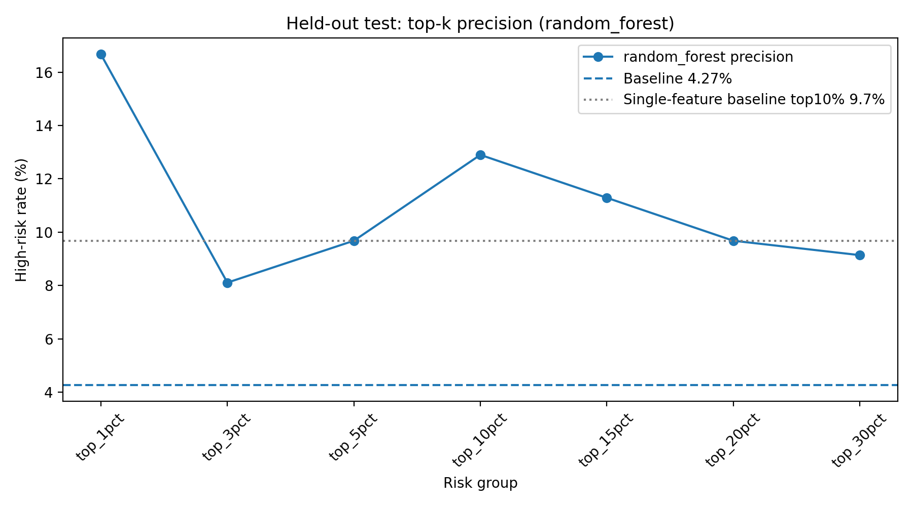
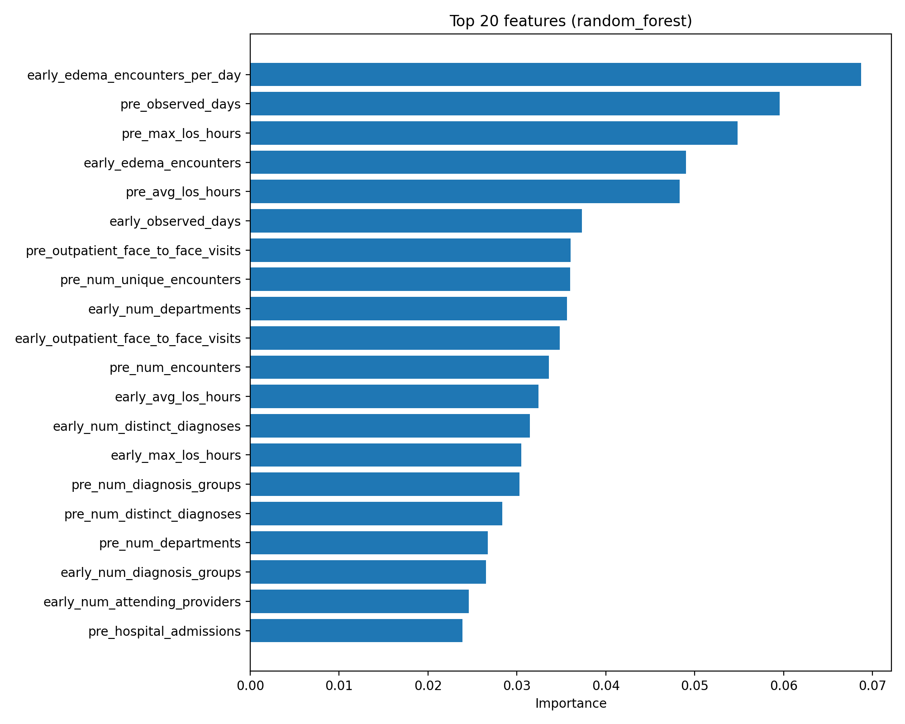
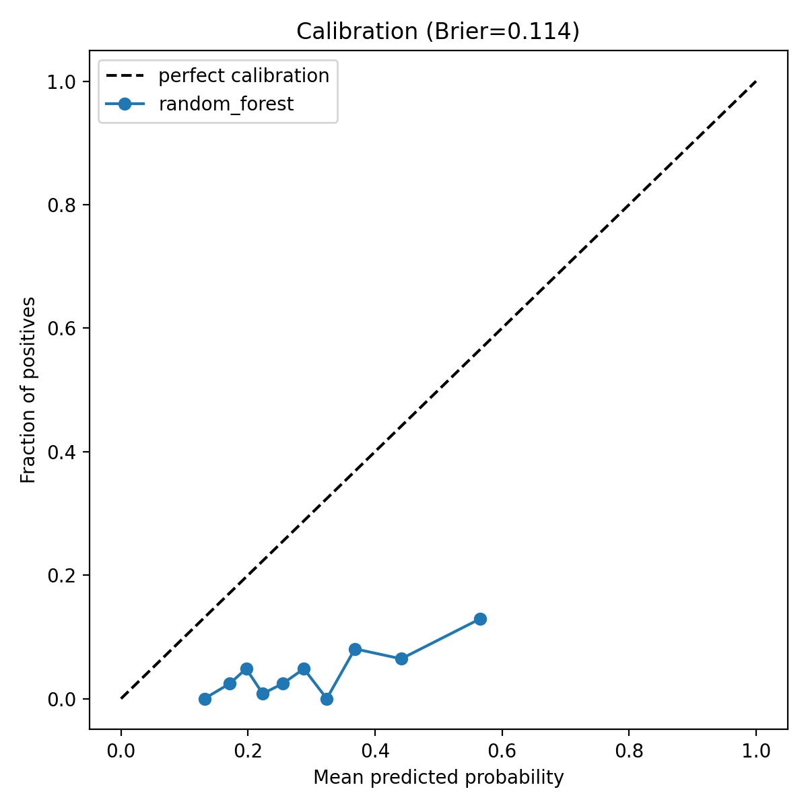
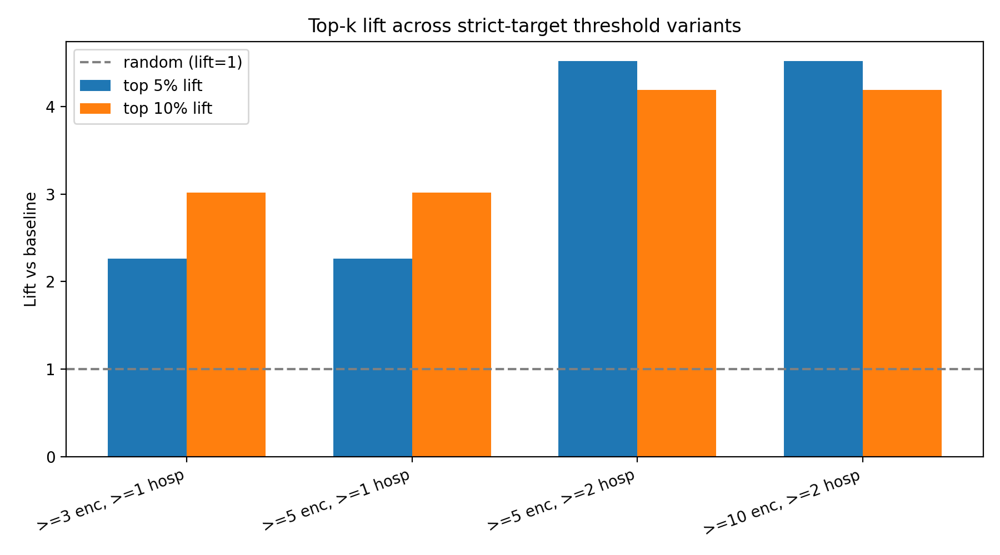

# Edema Outreach Risk Model


**A risk-ranking model that flags edema patients likely to deteriorate in the 60 days after diagnosis — so a hospital's limited outreach staff can call the highest-risk patients first, instead of at random.**

Built for **DataFest 2026** (healthcare track, using anonymized encounter data from Stormont Vail Health) by Team 6 — "Git Push & Pray."

## Table of contents

- [Why we built this](#why-we-built-this)
- [The problem](#the-problem)
- [The approach](#the-approach)
- [Results](#results)
- [Dashboard](#dashboard)
- [Repo structure](#repo-structure)
- [Running it](#running-it)
- [Data & privacy](#data--privacy)
- [Limitations](#limitations)
- [Where we want to take this](#where-we-want-to-take-this)

## Why we built this

Edema shows up everywhere in a hospital — a swollen ankle, a puffy face — and almost every time, it gets the same response: give a diuretic, send the patient home. That's the right call most of the time. But for a meaningful minority, edema is the first visible signal of something much worse underneath: heart failure, kidney disease, liver failure. Those patients look identical to the routine cases at intake, and by the time the underlying condition becomes obvious, it's often an ICU admission instead of a phone call.

We wanted to see if the data the hospital already has — encounters, diagnoses, department visits, timing — could separate those two groups *early*, before anyone's vitals crash, using nothing but the patient's own history. Not to replace clinical judgment, but to give a handful of overworked care coordinators a shortlist worth calling first.

## The problem

- Thousands of edema patients pass through routine and low-acuity settings every year; only a handful of coordinators are available to follow up.
- Selected edema diagnoses carry a **7x higher mortality rate** than the general patient population.
- Random outreach only intercepts about **5%** of the patients who actually go on to have a high-risk trajectory.
- A missed high-risk patient can mean a $15,000 ICU admission where a $50 phone call earlier could have redirected care.

## The approach

- Build a 60-day "early window" feature set per patient from their encounters, diagnoses, department visits, and utilization patterns before and after their first edema diagnosis — no vitals or labs required, since this needs to work as an early screen using only data the hospital already has at intake.
- Deliberately exclude age/birth-year as a model feature (age is reported for auditing only) so the model isn't just re-deriving "old patients are risky," and so outreach doesn't quietly become age discrimination.
- Compare six classifiers — Random Forest, Extra Trees, Logistic Regression, Gradient Boosting, XGBoost, and Histogram Gradient Boosting — with repeated stratified cross-validation.
- Optimize for **top-decile precision and lift** rather than overall accuracy, because the real operational question is: *"If staff can only call the top 5–10% of patients, how much better is that list than calling people at random?"*
- Calibrate the winning model (isotonic regression) so predicted risk scores behave like real probabilities, not just a ranking.
- Surface everything through a Streamlit dashboard built for hospital ops and care coordinators, not data scientists.

## Results

Best model: **Random Forest**, selected on mean top-10% precision across cross-validation folds.

| Model | ROC AUC | Avg Precision | Top-10% Precision | Top-10% Lift |
|---|---|---|---|---|
| **Random Forest** | 0.674 | 0.169 | 0.169 | **3.00x** |
| Extra Trees | 0.677 | 0.157 | 0.168 | 2.97x |
| Logistic Regression | 0.633 | 0.146 | 0.132 | 2.34x |
| Gradient Boosting | 0.626 | 0.125 | 0.130 | 2.31x |
| XGBoost | 0.613 | 0.126 | 0.112 | 1.99x |
| Hist. Gradient Boosting | 0.594 | 0.115 | 0.109 | 1.94x |

Cohort: 4,289 edema patients, 6.99% baseline high-risk rate. Targeting the top 10% by predicted risk instead of calling patients at random gets **~3x** more true high-risk patients per call — turning a $50 phone call into the tool that catches what would otherwise become a $15,000 ICU admission. In our held-out test set, roughly 1 in 6 flagged patients (17%) was a true high-risk patient.

<p align="center">
  
  
</p>
<p align="center">
  
  
</p>

More charts (model comparisons, age-stratified performance, bootstrap confidence intervals) are in [`outputs/figures/`](outputs/figures/), and the numbers behind every chart are in [`outputs/tables/`](outputs/tables/) — all cohort-level aggregates, no patient rows.

## Dashboard

The Streamlit app ([`final/svh_journey_dashboard.py`](final/svh_journey_dashboard.py)) turns the notebook's output into something a hospital ops team can actually use day to day, with six views:

- **Executive Overview** — top-line volume, utilization, and complexity metrics
- **Journey Complexity** — how convoluted a patient's care path is, and where that clusters
- **Department Flow** — where patients move between departments, and where handoffs create friction
- **Diagnosis Explorer** — diagnosis-level patterns across the whole patient population
- **Edema Outreach** — the risk model itself: feature importance, ranked outreach tiers, model card
- **SDOH & Geography** — social-determinant screening rates and geographic distribution

> We don't have a live screenshot of the running dashboard in this repo yet — the charts above are the real, saved model outputs it renders. If you'd like, drop a screenshot into `docs/` and we'll wire it into this README.

## Repo structure

```
final/
  SVH_final_submission.ipynb     # data prep -> feature engineering -> model training -> outreach list
  svh_journey_dashboard.py       # Streamlit dashboard reading the notebook's saved outputs
  dashboard_requirements.txt
outputs/
  figures/                       # model performance & cohort charts (aggregate, no patient data)
  tables/                        # model metrics, feature importance, calibration, cohort summaries
```

## Running it

The notebook expects `data/` (raw hospital extracts) and writes to `outputs/` one level up. That raw data is **not included in this repo** (see below), so the notebook can't be re-run end-to-end without it — the code and the aggregate results it produced are here for review.

If you do have access to the underlying data:

```bash
cd final
python -m venv venv && source venv/bin/activate
python -m pip install -r dashboard_requirements.txt
# run SVH_final_submission.ipynb top to bottom, then:
python -m streamlit run svh_journey_dashboard.py
```

## Data & privacy

This project uses a hospital patient dataset provided under DataFest's competition data-use terms, which prohibit redistributing the raw or patient-level data. Accordingly, this repo contains **only**:

- the modeling/dashboard code,
- and cohort-level aggregate outputs (counts, rates, feature importances, calibration curves, model metrics) with no per-patient rows or identifiers.

No raw patient records, per-patient predictions, or outreach lists are published here.

## Limitations

- This is a risk-ranking tool, not a diagnostic or clinical decision system.
- Trained and evaluated on one health system; generalization elsewhere is unverified.
- The "deceased" label used for training doesn't carry an exact death date, so the target is a heuristic, not a ground-truth clinical outcome.
- Features lean on prior healthcare utilization, which correlates with age, comorbidity, and access — the model needs to be re-validated before any real deployment, not used as-is.

## Where we want to take this

Edema was the entry point because it's common, cheap to screen for, and easy to dismiss — which is exactly why it's a good proxy for a broader idea: a lot of serious conditions probably leave similar "quiet" signals in routine encounter data long before they show up as an emergency. The same early-window, utilization-pattern approach we used here — no vitals, no labs, just how a patient moves through the system — isn't specific to edema. It should generalize to other conditions that get routinely under-triaged: things like early-stage heart failure follow-up, recurrent falls, or diabetes complications.

What we'd need to actually try that is more data: access to other diagnosis cohorts within a hospital's encounter history, and ideally a second health system to test whether the model's signal holds up outside where it was trained. If a hospital or research group wants to explore that with us, we'd love to hear from you.
